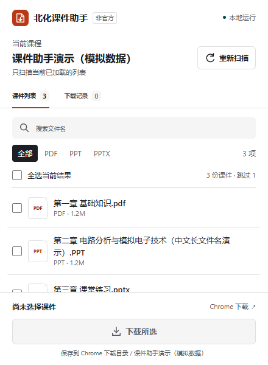

# 北化课件助手

在北京化工大学 THEOL 教学平台的**课程资源**和**单元学习**页面中，扫描、搜索、勾选 PDF / PPT / PPTX，再交给 Chrome 下载原文件。课程资源只扫描当前目录；单元学习可选择当前单元，或确认后汇总当前课程的全部单元。非学校官方扩展，不转换课件，不上传数据。

> 已通过 246 项源码自动化测试（含 22 项站点构建测试）、5 项原生 Chrome 浏览器测试（含单元学习端到端流程）和 146 项自包含书签测试。课程资源的一份真实 PPT 下载已完成验证；真实 PDF/PPTX 下载尚未逐项实测；PPT 落盘容器存在字节差异，文稿和图片流校验一致。单元学习模式目前只有合成夹具证据和真实页面的**只读元数据探针**结果（当前单元与全部单元均已放行），**真实单文件下载验收尚未执行**。详细范围见 [验证记录](docs/verification.md)。

## 安装

需要桌面版 Chrome 120 或更新版本，以及能正常访问课件的学校平台账号。**只安装和使用扩展不需要 Node.js 或 Python。**

1. 从 [Releases](https://github.com/vg188/THEOL-downloader/releases/tag/v1.0.1) 下载并解压 [安装包](https://github.com/vg188/THEOL-downloader/releases/download/v1.0.1/buct-course-downloader.zip)（或直接在[官网](https://vg188.github.io/THEOL-downloader/)点「下载 ZIP（手动安装）」），保留解压目录，不要直接选择 ZIP 文件。本地构建后也可以用 `dist/buct-course-downloader.zip`。
2. 在 Chrome 地址栏输入 `chrome://extensions`，打开右上角的“开发者模式”。
3. 点击“加载已解压的扩展程序”，选择**直接包含 manifest.json 的文件夹**。
   - 在本项目中，直接选择 `E:\codex\File-scri\dist\extension`。
   - 使用 ZIP 时，选择解压后包含 manifest.json 的目录，而不是其父目录。
4. 扩展列表应出现“北化课件助手”，版本 1.0.1。点击工具栏拼图图标，将它固定到工具栏。

Chrome 企业策略可能禁止开发者模式或侧载扩展；本工具不绕过这些限制。

## 下载课件

1. 在**安装了扩展的同一个 Chrome 浏览器配置中**手动登录 [学校教学平台](https://course.buct.edu.cn/)。
2. 打开一门课程，进入“课程资源”中的课件目录，或进入“单元学习”中的某个单元，让列表加载完成，并保持这个课程标签页为当前页。
3. 点击工具栏的“北化课件助手”，在面板顶部选择扫描范围，再点击扫描按钮（“扫描当前目录”“扫描当前单元”或“扫描全部单元”）。扫描只读取文件信息，**不会自动勾选或下载**。
4. 根据文件名搜索，或切换 PDF / PPT / PPTX 筛选。勾选需要的文件，点击“下载所选”。首次使用建议只选一份，先核对下载结果。
5. 在“下载记录”查看排队、校验、下载、完成或失败状态。完成后可点击“在文件夹中显示”；失败项需手动点击“重试”。

**结果核对：**到 Chrome 下载页查看任务，再检查实际文件名、扩展名、大小，尝试用对应软件打开。扩展的文件头检查不等于整文件完整性检查或安全扫描。

### 选择规则

- “全选当前结果”只操作当前筛选可见的文件。
- 切换搜索或格式筛选后，其他已选文件仍保留，底部会显示隐藏的已选数量。
- 重新扫描或检测到目录、页面发生变化后，会清空旧选择；已提交的下载任务不受影响。
- 同一文件正在排队或下载时，不会因重复点击再创建一份任务。已完成文件可以由你明确重新选择下载。

### 扫描范围

扫描范围只有一个控件，取值取决于页面：

| 页面 | 扫描范围 | 说明 |
| --- | --- | --- |
| 课程资源 | **当前目录** | 固定值；课程资源页面不提供“全部单元”选项 |
| 单元学习 | **当前单元**（默认） | 只解析当前已加载的单元，不请求其他单元页面 |
| 单元学习 | **全部单元** | 用户确认后，读取当前课程的全部单元页面并汇总 |

- **安全默认：**扩展面板每次打开都从当前页面允许的安全默认值开始（课程资源为“当前目录”，单元学习为“当前单元”），不保存上一次的范围选择；页面刷新或页面切换后同样回到安全默认值。
- **全部单元是显式操作：**确认框先显示将要读取的单元数量，并说明不会下载课件正文；在你点击“确认扫描”之前，不会发出任何单元页面请求。扫描过程中扫描范围控件不可切换。
- **并发与超时：**读取单元页面最多 2 个并发，识别课件元数据最多 3 个并发，每个请求限时 15 秒。
- **重复课件：**同一课件出现在多个单元时只列出一项（保留第一次出现的顺序），扩展结果会标注“另见 N 个单元”，不会重复请求或重复下载。
- **单元读取失败：**单个单元读取失败不会丢弃其他单元的成果；成功结果照常显示，失败单元在结果下方单独列出。
- **选择失效：**切换课程、栏目、单元、扫描范围或页面刷新后，未提交的旧选择会被清空；已经提交的 Chrome 下载任务不受影响。

## 保存位置和队列

- 默认保存到 **Chrome 配置的下载目录 / 课程名 / 原始文件名**。不能识别课程名时使用“课件”文件夹。当前单元和全部单元模式使用同一路径，**不新增单元子文件夹**。
- 替换 Windows 不允许的路径字符，处理保留设备名和过长文件名，并保留扩展名。
- 同名文件由 Chrome 自动追加编号，不覆盖已有文件。
- 同时最多下载 2 份，其余排队。关闭面板不会取消已提交队列。
- 下载任务由后台管理，会与 Chrome 下载记录核对；不会依赖弹出面板一直打开。
- 扩展队列只保留在本次浏览器会话。**重启浏览器、重新加载、禁用或更新扩展后，不承诺恢复尚未交给 Chrome 的排队项。** Chrome 已接收的任务按 Chrome 自身机制处理。
- 若 Chrome 或系统显示另存为、安全检查等提示，请按提示操作。扩展不能代替你处理系统对话框。

## 首版范围

只支持 `https://course.buct.edu.cn/` 上已观察到的 THEOL 页面结构。扫描范围是三种固定标签之一：

- **当前目录**（课程资源）：只扫描当前已加载的列表。
- **当前单元**（单元学习）：只解析当前已加载的单元，不请求其他单元页面。
- **全部单元**（单元学习）：确认后读取当前课程的全部单元页面并汇总。

边界：不递归进入课程资源子目录、不自动翻页、不跨课程扫描；不扫描视频、作业、链接或其他非 PDF/PPT/PPTX 文件；不遍历 `/meol/buildless/resFolderViewList.do` 等辅助路由，也不据此拼装单元入口或下载地址。换目录、换单元或翻页后重新扫描即可。

同一套页面识别、单元解析和 URL 校验规则也用于自包含书签轻量版，两者提供相同的三种扫描范围。书签自带版本号与构建日期，官网安装卡片显示的就是书签里的同一行；在课件页按 F12 执行 `copy(__THEOL_DOWNLOADER_BOOKMARKLET_V1__.diagnose())` 可拿到脱敏的页面识别结果（只有数量、页面路径和错误码，不含课程名、课程 ID、文件名），反馈问题时不需要誊抄页面内容。

列表名称没有扩展名时，扩展会按服务器声明的字符编码（包括平台实际使用的 GBK）读取预览页的原始文件名、大小和实际下载链接。没有可用下载入口、不支持的文件格式或无法识别的页面，会跳过或显示原因，不猜测其他资源 ID。

## 常见问题

| 情况 | 处理方式 |
| --- | --- |
| 提示先打开学校教学平台 | 切回学校课程标签页，再从工具栏打开扩展；不要单独打开 popup.html 使用。 |
| 提示进入课件目录 | 进入“课程资源”并打开具体文件夹，或进入“单元学习”中的单元，等待列表加载后重试。 |
| 显示登录失效、无下载入口或平台返回网页 | 先在学校网页中确认登录及该课件的正常下载权限，再重新扫描或重试。不要把密码发给扩展或其他人。 |
| 选择“全部单元” | 确认框会先显示将读取的单元数量；扫描只读取单元页面和课件元数据，不会自动勾选或下载课件正文。 |
| 部分资源未能识别 | 展开列表下方的失败原因；单个资源失败不会阻止其他资源显示。 |
| 部分单元未能读取 | 其余单元的结果照常显示，失败单元单独列出；确认登录状态和网络后重新扫描。 |
| 扫描超时 | 读取单元页面最多 2 个并发、识别课件元数据最多 3 个并发，每个请求限时 15 秒。检查校园网络、VPN 或平台状态，稍后重试。 |
| 文件显示失败 | 查看“下载记录”和 Chrome 下载页。登录失效、网络中断、磁盘不足、系统阻止及用户取消需分别处理。 |
| 找不到下载文件 | 检查 Chrome 的下载目录和对应课程子文件夹，或点击“在文件夹中显示”。 |
| 页面改版、按钮动态生成或资源跳转到其他域名 | 首版可能无法识别；不扩大站点权限或绕过平台限制。 |

### 下载前校验的影响

每次提交或手动重试，扩展先向**所选资源**发出带 Range 的 GET 请求，最多保留 1024 字节做文件头检查，然后取消读取；不使用平台不支持的 HEAD 请求。服务器忽略 Range 时，可能在取消前额外发送一些数据。

这个校验请求**可能增加平台的下载计数**。校验通过后，Chrome 才发起正式下载，因此不是“每份文件只产生一次服务器请求”。校验与正式下载之间若登录状态变化，仍需按实际下载结果核对。

## 权限与隐私

仅申请 scripting、downloads、storage，以及 `https://course.buct.edu.cn/*` 站点权限：用于按需读取课程页面、调用 Chrome 下载管理器、保存本次会话的文件元数据和状态。

不申请 cookies、debugger 或所有网站权限；不读取或导出 Cookie，不读取账号密码，不添加遥测或远程服务。请求使用浏览器现有登录状态。平台账号权限、网络条件和 Chrome 策略仍然生效。

## 从源码构建

开发需要 Node.js 22+、npm；打包 ZIP 另需 Python 3.9+（只用标准库）。

```powershell
npm ci
npm test
npm run test:browser
npm run test:bookmarklet
npm run test:site
npm run build
npm run build:site
npm run package
```

- 加载目录：`dist/extension/`。
- 分发包：`dist/buct-course-downloader.zip`，根目录只包含 10 个发布文件。
- `npm run build:site` 生成站点与自包含书签产物；它不进入扩展 ZIP。
- 构建工具和 jsdom 仅用于开发测试，不进入扩展运行时。
- 浏览器调试记录、测试浏览器配置、下载的课件及登录数据不进入 Git 或 ZIP。

## 更新与重新加载

修改源码或替换解压目录后，按下面的顺序更新，避免丢失扩展内存中的排队状态：

1. 先等待“下载记录”中的 `preparing`、下载中或排队任务完成或失败；已经交给 Chrome 的下载按 Chrome 自身机制继续，但尚未交给 Chrome 的队列不承诺在重新加载后恢复。
2. 源码安装先运行 `npm run build`；ZIP 安装则重新解压 `dist/buct-course-downloader.zip`，并在扩展页选择新的、直接包含 `manifest.json` 的目录。
3. 打开 `chrome://extensions`，在“北化课件助手”卡片上点击“重新加载”。不要在仍有未完成队列时强制终止浏览器或删除旧目录。
4. 刷新学校课程标签页，重新进入课件目录或单元学习页面，再打开扩展并执行一次扫描。

当前发布版本为 **1.0.1**。

## 界面示例

以下截图使用隔离浏览器中的**模拟课程数据**，不是已完成学校课件下载的证明。



[查看 360 像素筛选与键盘焦点示例](docs/images/popup-360.png) · [验证结果与未验收项](docs/verification.md) · [真实验收清单](docs/acceptance-checklist.md) · [官网与书签轻量版](https://vg188.github.io/THEOL-downloader/)
